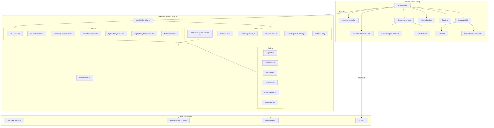

# 🏥 Code Health & Technical Debt Feature

> **Gatekeeper AI & Debt Visualization Dashboard** — A comprehensive code quality monitoring system that connects to GitHub repositories, analyzes codebase health in real-time, gates Pull Requests with AI-powered reviews, and provides actionable insight to reduce technical debt.

---

## Table of Contents

1. [Feature Overview](#feature-overview)
2. [Architecture Diagram](#architecture-diagram)
3. [Backend — Data Models](#backend--data-models)
4. [Backend — API Endpoints](#backend--api-endpoints)
5. [Backend — Services](#backend--services)
6. [Backend — Analysis Engine](#backend--analysis-engine)
7. [Frontend — Page & Components](#frontend--page--components)
8. [Frontend — Hooks & Real-Time Layer](#frontend--hooks--real-time-layer)
9. [Key Algorithms & Formulas](#key-algorithms--formulas)
10. [Environment Variables](#environment-variables)
11. [Tech Stack](#tech-stack)

---

## Feature Overview

The Code Health feature provides a **full-stack technical debt management system** with four major pillars:

| Pillar | Description |
|---|---|
| **🤖 Gatekeeper AI** | AI-powered Pull Request analysis using Gemini 1.5 Flash. Runs syntax, complexity, and semantic checks on every PR to produce a PASS/BLOCK/WARN verdict. |
| **🔬 Codebase MRI** | Visual treemap + scatter-plot of the entire codebase. Color-coded by risk (healthy/warning/critical). Drill into any file for function-level complexity breakdown. |
| **📊 Top KPIs** | Dashboard showing Debt Ratio, PR Block Rate, Critical Hotspot Count, Risk Reduced, and overall Health Score — all with sparkline trend histories. |
| **📝 Actions Backlog** | CRUD-enabled refactor task board. Create/edit/delete/bulk-manage tasks tied to specific hotspot files, with priority and SLA tracking. |

### Key Capabilities

- **GitHub Integration** — Connect any GitHub repo via owner/repo URL. Fetches repository tree, file contents, commit history, and pull requests using the GitHub API (Octokit).
- **Polyglot Complexity Analysis** — Supports 10+ languages: JavaScript, TypeScript, Python, Java, Kotlin, Go, Ruby, PHP, C/C++/C#, Rust, Swift.
- **Churn Analysis** — Uses `simple-git` to measure file modification frequency over configurable time periods (default 90 days).
- **AI Code Review** — Gemini 1.5 Flash LLM scans PR diffs for security, correctness, maintainability, performance, and testing issues.
- **Real-Time Updates** — Socket.IO pushes analysis progress, PR status changes, and task events to the frontend live.
- **Time-Travel Snapshots** — Sprint-over-sprint comparison of codebase metrics for trend analysis.

---

## Architecture Diagram



---

## Backend — Data Models

### 1. `Repository` — `backend/models/Repository.js`

Stores metadata about connected GitHub repositories.

| Field | Type | Description |
|---|---|---|
| `owner` | String | GitHub org/user (e.g. `YASH-DHADGE`) |
| `name` | String | Repo name (e.g. `Digital-Dockers-Suite`) |
| `fullName` | String | `owner/name` format — **unique** |
| `url` | String | GitHub URL |
| `branch` | String | Branch to analyze (default: `main`) |
| `metadata.stars` | Number | Star count |
| `metadata.forks` | Number | Fork count |
| `metadata.language` | String | Primary language |
| `metadata.size` | Number | Repo size in KB |
| `metadata.totalFiles` | Number | Total file count |
| `metadata.analyzedFiles` | Number | Files successfully analyzed |
| `analysisStatus` | Enum | `pending` / `in_progress` / `completed` / `failed` |
| `analysisProgress` | Object | `{ stage, percentage, filesProcessed, currentFile, errors[] }` |
| `settings.includePatterns` | [String] | Glob patterns to include (default: `*.js`, `*.ts`, `*.py`, etc.) |
| `settings.excludePatterns` | [String] | Glob patterns to exclude (default: `node_modules`, `dist`, etc.) |
| `settings.complexityThreshold` | Number | Threshold for flagging (default: `10`) |
| `settings.churnPeriodDays` | Number | Churn lookback window (default: `90`) |

**Methods:**
- `canRefresh()` — Returns `true` if 5-minute cooldown has elapsed since last analysis.
- `refreshCooldown()` — Returns remaining seconds until refresh is allowed.

---

### 2. `CodebaseFile` — `backend/models/CodebaseFile.js`

Per-file analysis results including complexity, churn, risk, and function-level breakdown.

| Field | Type | Description |
|---|---|---|
| `repoId` | String | Repository identifier |
| `path` | String | File path within the repo |
| `sha` | String | Git hash for cache invalidation |
| `loc` | Number | Lines of code |
| `language` | Enum | `javascript` / `typescript` / `python` / `java` / `go` / `ruby` / `php` / `cpp` / `c` / `rust` / `swift` / `kotlin` / `csharp` / `html` / `css` / `scss` / `json` / `yaml` / `other` |
| `complexity.cyclomatic` | Number | Cyclomatic complexity |
| `complexity.cognitive` | Number | Cognitive complexity |
| `complexity.normalized` | Number | 0–100 percentile |
| `complexity.healthScore` | Number | `100 - normalized` |
| `churn.totalCommits` | Number | All-time commit count |
| `churn.recentCommits` | Number | Commits in last 90 days |
| `churn.churnRate` | Number | Commits per week |
| `churn.topContributors` | Array | `[{ email, name, commits }]` |
| `risk.score` | Number | 0–100 composite risk |
| `risk.category` | Enum | `healthy` / `warning` / `critical` |
| `risk.color` | String | Hex color for visualization |
| `risk.confidence` | Enum | `low` / `medium` / `high` |
| `functions` | Array | `[{ name, complexity, startLine, endLine, params }]` |
| `prHistory` | Array | `[{ prNumber, prId, action, timestamp, healthDelta }]` |
| `blockCount` | Number | Times this file caused a PR block |
| `historicalMetrics` | Array | `[{ date, complexity, loc, risk }]` — for trend charts |
| `recommendations` | Array | `[{ type, message, priority, generatedAt }]` — AI suggestions |

**Pre-save Hook:** Automatically calculates `risk.score`, `risk.category`, `risk.color`, and `risk.confidence` using the formula:

```
rawRisk = (cyclomatic × 0.6) + (recentCommits × 0.4)
finalRisk = isHotspot ? min(100, rawRisk × 1.2) : min(100, rawRisk)
```

---

### 3. `PullRequest` — `backend/models/PullRequest.js`

Stores PR metadata and multi-layer analysis results.

| Field | Type | Description |
|---|---|---|
| `prNumber` | Number | GitHub PR number |
| `repoId` | String | Repository identifier |
| `author` | String | PR author |
| `title` | String | PR title |
| `status` | Enum | `PENDING` / `PASS` / `BLOCK` / `OVERRIDDEN` / `WARN` |
| `healthScore.current` | Number | Current health score |
| `healthScore.delta` | Number | Change from previous |
| `filesChanged` | [String] | Modified file paths |
| `analysisResults.lint` | Object | `{ errors, warnings, rawOutput }` |
| `analysisResults.complexity` | Object | `{ healthScoreDelta, fileChanges[] }` |
| `analysisResults.ticketAlignment` | Object | `{ aligned, confidence, explanation }` |
| `analysisResults.aiScan` | Object | AI analysis with verdict, category scores, and findings |

**AI Scan Categories (each scored 1–5):**
- Security
- Correctness
- Maintainability
- Performance
- Testing

---

### 4. `RefactorTask` — `backend/models/RefactorTask.js`

Manages the refactor backlog with task tracking.

| Field | Type | Description |
|---|---|---|
| `digitalDockersTaskId` | String | Linked task ID — **unique** |
| `digitalDockersTaskUrl` | String | URL to the task board |
| `fileId` | ObjectId | Reference to `CodebaseFile` |
| `status` | Enum | `OPEN` / `IN_PROGRESS` / `DONE` |
| `priority` | Enum | `HIGH` / `MEDIUM` / `LOW` |
| `sla` | Date | Deadline |
| `assignee` | String | Assigned team member |
| `riskScoreAtCreation` | Number | Risk score when task was created |

---

### 5. `AnalysisSnapshot` — `backend/models/AnalysisSnapshot.js`

Time-series data for sprint-over-sprint trend visualization (time-travel).

| Field | Type | Description |
|---|---|---|
| `repoId` | ObjectId | Repository reference |
| `sprint` | Number | Sprint number |
| `aggregateMetrics` | Object | `{ totalFiles, avgComplexity, avgChurn, avgRisk, hotspotCount, warningCount, healthyCount, totalLoc, healthScore }` |
| `topHotspots` | Array | `[{ path, risk, complexity, churnRate, loc }]` |
| `files` | Array | Full file snapshot for high-risk files |
| `comparison` | Object | `{ riskDelta, hotspotsAdded, hotspotsResolved, healthScoreDelta }` |
| `events` | Array | Notable events: `pr_blocked`, `hotspot_created`, `task_completed`, `refactor_completed` |

**Static Methods:**
- `getLatest(repoId)` — Returns the most recent snapshot.
- `getRange(repoId, startSprint, endSprint)` — Returns snapshots within a sprint range.

**Instance Methods:**
- `calculateComparison()` — Computes deltas against the previous sprint's snapshot.

---

### 6. `MetricsHistory` — `backend/models/MetricsHistory.js`

Time-series storage for KPI sparkline trends.

| Field | Type | Description |
|---|---|---|
| `metricType` | Enum | `debtRatio` / `blockRate` / `hotspots` / `riskReduced` |
| `value` | Number | Metric value |
| `calculatedAt` | Date | Timestamp |
| `metadata` | Object | Additional context |
| `repoId` | String | Repository filter |

---

## Backend — API Endpoints

All routes are prefixed with `/api/tech-debt` and defined in `backend/routes/techDebtRoutes.js`.

### Pull Requests

| Method | Route | Controller | Description |
|---|---|---|---|
| `GET` | `/prs` | `getPullRequests` | Get all PRs for the Gatekeeper feed |
| `POST` | `/sync-prs` | `syncPullRequests` | Sync PRs from GitHub for a repository |
| `POST` | `/analyze-pr` | `analyzePullRequest` | Analyze a specific PR (runs all layers) |
| `POST` | `/analyze-all-prs` | `analyzeAllPRs` | Analyze all open PRs for a repository |

### Codebase Analysis

| Method | Route | Controller | Description |
|---|---|---|---|
| `GET` | `/hotspots` | `getHotspots` | Get hotspot data for the MRI treemap |
| `GET` | `/summary` | `getSummary` | Get aggregate KPI summary metrics |
| `GET` | `/gatekeeper-feed` | `getGatekeeperFeed` | Get enriched PR feed with risk details |
| `GET` | `/files/:fileId` | `getFileDetails` | Get file details with function breakdown |

### Repository Management

| Method | Route | Controller | Description |
|---|---|---|---|
| `GET` | `/repositories` | `getRepositories` | List all connected repositories |
| `GET` | `/repositories/:repoId` | `getRepository` | Get single repo by ID or fullName |
| `POST` | `/connect-repo` | `connectRepo` | Connect a GitHub repo and trigger full analysis |
| `POST` | `/repositories/:repoId/refresh` | `refreshRepo` | Re-analyze a connected repo (5-min cooldown) |

### Refactor Tasks (CRUD)

| Method | Route | Controller | Description |
|---|---|---|---|
| `GET` | `/tasks` | `getRefactorTasks` | List all refactor tasks |
| `POST` | `/tasks` | `createRefactorTask` | Create a new refactor task |
| `PUT` | `/tasks/:id` | `updateRefactorTask` | Update task status/priority/assignee |
| `DELETE` | `/tasks/:id` | `deleteRefactorTask` | Delete a refactor task |

### Time-Travel Snapshots

| Method | Route | Controller | Description |
|---|---|---|---|
| `GET` | `/snapshots` | `getSnapshots` | Get all analysis snapshots |
| `GET` | `/snapshots/:snapshotId` | `getSnapshotDetails` | Get specific snapshot by ID |

### Analysis Progress

| Method | Route | Controller | Description |
|---|---|---|---|
| `GET` | `/analysis/:analysisId/progress` | `getAnalysisProgress` | Poll analysis progress |

### System Health (separate route: `/api/health`)

| Method | Route | Description |
|---|---|---|
| `GET` | `/api/health` | System health (MongoDB, Queue, Redis) |
| `GET` | `/api/health/detailed` | Detailed health (+ uptime, memory, Node version) |

---

## Backend — Services

### 1. `GitHubService` — `backend/services/githubService.js`

GitHub API wrapper using Octokit and `simple-git`.

| Method | Description |
|---|---|
| `getRepository(owner, repo)` | Fetch repo metadata (stars, forks, language, etc.) |
| `getRepositories()` | List authenticated user's repos |
| `getPullRequests(owner, repo, state)` | Get PRs (open/closed/all) |
| `getFilesChanged(owner, repo, prNumber)` | Get files modified in a PR |
| `getFileContent(owner, repo, path, ref)` | Fetch file content from a specific branch |
| `getFileCommitHistory(owner, repo, filePath, since)` | Get commit history for churn analysis |
| `getPRDiff(owner, repo, prNumber)` | Get the raw diff of a PR |
| `cloneRepository(owner, repo, targetDir)` | Clone repo locally for deep analysis |
| `getRepositoryTree(owner, repo, branch)` | Get full file tree |
| `postCommitStatus(owner, repo, sha, status, desc)` | Post Gatekeeper check status on GitHub |
| `postReviewComment(owner, repo, prNumber, body)` | Post review comments on PRs |
| `postInlineComments(owner, repo, prNumber, comments)` | Post inline comments on specific lines |
| `postGatekeeperSummary(owner, repo, prNumber, results, status)` | Post comprehensive Gatekeeper review summary |
| `verifyWebhookSignature(payload, signature, secret)` | Verify GitHub webhook authenticity |

---

### 2. `ComplexityAnalysisService` — `backend/services/complexityAnalysisService.js`

**935 lines** — Polyglot code complexity analyzer supporting 10+ languages.

| Method | Description |
|---|---|
| `analyzeFile(filePath, fileContent)` | Route to language-specific analyzer |
| `analyzeJavaScript(filePath, fileContent)` | JS/TS analysis using `typhonjs-escomplex` + `@babel/parser` |
| `analyzePython(fileContent, loc)` | Indentation-based complexity for Python |
| `analyzeJavaKotlin(fileContent, loc, ext)` | Class/method detection for Java & Kotlin |
| `analyzeGo(fileContent, loc)` | `func` complexity analysis for Go |
| `analyzeRuby(fileContent, loc)` | Method counting for Ruby |
| `analyzePHP(fileContent, loc)` | Class/function detection for PHP |
| `analyzeCFamily(fileContent, loc)` | C/C++/C# analysis |
| `analyzeRust(fileContent, loc)` | Rust analysis |
| `analyzeSwift(fileContent, loc)` | Swift analysis |
| `analyzeGeneric(fileContent, loc)` | Fallback for unsupported languages |
| `calculateMaintainability(complexity, loc, numFunctions)` | Maintainability Index (0–100) |
| `calculateHealthScore(complexity, maintainability)` | Health score (0–100, where 100 = simple) |
| `analyzePRChanges(beforeFiles, afterFiles)` | Compare before/after for delta calculation |
| `identifyComplexFunctions(analysisResult, threshold)` | Flag functions exceeding threshold |
| `isAnalyzableFile(filename)` | Check if file extension is supported |

---

### 3. `ChurnAnalysisService` — `backend/services/churnAnalysisService.js`

Uses `simple-git` to measure file modification frequency.

| Method | Description |
|---|---|
| `getFileChurnRate(filePath, days)` | Commit count for a file in the last N days |
| `getChurnRates(filePaths, days)` | Batch churn rates for multiple files |
| `getAllFilesChurn(days)` | All files with their churn rates |
| `identifyHotspots(churnData, complexityData, thresholds)` | Files with high churn + high complexity |
| `getFileModificationPattern(filePath, days)` | Who, when, how often — contributor analysis |
| `calculateRiskScore(churnRate, complexity)` | Normalized 0–100 risk using logarithmic scaling |
| `getFilesChangedInCommit(commitHash)` | Files changed in a specific commit |
| `getChurnTrend(filePath, intervals, intervalDays)` | Churn trend over 6 intervals × 30 days |

---

### 4. `PRAnalysisService` — `backend/services/prAnalysisService.js`

**672 lines** — Multi-layer PR analysis engine.

| Method | Description |
|---|---|
| `analyzePR(owner, repo, prNumber)` | Full PR analysis pipeline (lint → complexity → AI) |
| `analyzeFile(owner, repo, file, prNumber)` | Analyze a single file from the PR |
| `extractAddedLines(patch)` | Parse git patch to isolate added lines |
| `shouldSkipFile(filename)` | Skip lock files, configs, images, etc. |
| `isJavaScriptFile(filename)` | Check JS/TS extensions |
| `checkBasicSyntax(content, filename)` | Quick syntax validation |
| `calculateHealthDelta(results)` | Compute health score change |
| `calculateOverallRisk(results)` | Overall risk score (0–100) |
| `determineVerdict(results)` | PASS / BLOCK / WARN decision |
| `mapVerdictToAIScan(verdict)` | Map to AI scan verdict enum |
| `generateSummary(results, fileCount)` | Human-readable analysis summary |

**Verdict Rules:**
- **BLOCK** → Critical issues found (lint errors > 5, health delta < -20, AI verdict = BAD)
- **WARN** → Minor concerns (lint warnings > 10, small health regression, AI = RISKY)
- **PASS** → All checks clean

---

### 5. `SyntaxAnalysisService` — `backend/services/syntaxAnalysisService.js`

Lightweight syntax checker (replaces ESLint for portability).

| Method | Description |
|---|---|
| `analyzeFile(filePath, fileContent)` | Check for `console.log`, `debugger`, `TODO/FIXME` |
| `analyzeFiles(files)` | Batch analysis |
| `calculateHealthScore(lintResults)` | Score from 0–100 (error = -10pts, warning = -2pts) |
| `analyzePRDiff(filesChanged)` | Analyze only changed lines in a PR |

---

### 6. `DependencyAnalysisService` — `backend/services/dependencyAnalysisService.js`

AST-based dependency analysis using `@babel/parser` and `@babel/traverse`.

| Method | Description |
|---|---|
| `analyzeFile(filePath, fileContent)` | Extract imports, exports, requires |
| `buildDependencyGraph(files)` | Build full dependency graph |
| `detectCircularDependencies(graph)` | DFS-based circular dependency detection |
| `calculateCoupling(graph)` | Afferent/efferent coupling + instability index |
| `identifyHighlyCoupledFiles(metrics, threshold)` | Flag highly coupled files |
| `getDependencyTree(file, graph, maxDepth)` | Recursive dependency tree |

---

### 7. `MetricsCalculator` — `backend/services/metricsCalculator.js`

Computes and stores KPI metrics for the dashboard.

| Method | Description |
|---|---|
| `calculateDebtRatio(repoId)` | Average risk score across all files |
| `calculateBlockRate(repoId, days)` | PR block rate in the last 7 days |
| `identifyCriticalHotspots(repoId, threshold)` | Files with risk > 70 |
| `calculateRiskReduced(repoId, days)` | Sum of positive health deltas from passed PRs |
| `getAllMetrics(repoId)` | Aggregate all KPI metrics |
| `getMetricTrend(metricType, repoId, days)` | Historical trend data for sparklines |

---

## Backend — Analysis Engine

The `backend/services/analysis/` directory contains the core analysis pipeline:

### `analysisEngine.js` — Orchestrator

Runs the full 3-layer analysis pipeline for a PR:

```
Layer 1: Syntax (Linter)     → linterService.js
Layer 2: Complexity (Ratchet) → complexityService.js
Layer 3: Semantics (AI)       → llmScanService.js (Gemini) or openaiService.js
```

**Ratchet Logic:** If the complexity health score of the new code is **lower** than the previous baseline, the PR is blocked. Code quality can only improve or stay the same — never degrade.

### `llmScanService.js` — Gemini AI Scanner

Uses **Google Gemini 1.5 Flash** to perform semantic code review.

- Takes up to 3 changed files (first 1000 chars each)
- Prompts for structured JSON output with:
  - **Verdict:** `GOOD` / `RISKY` / `BAD`
  - **Category Scores (1–5):** Security, Correctness, Maintainability, Performance, Testing
  - **Findings:** File-specific issues with line ranges, suggestions, and severity

### `ticketAlignmentService.js` — Ticket Alignment

Checks whether PR changes align with the linked Jira/task ticket requirements.

### `linterService.js` & `staticService.js`

- **linterService** — Lightweight linting checks on code diffs
- **staticService** — Static analysis rules for common code smells

---

## Frontend — Page & Components

### `TechDebtPage.jsx` — Main Dashboard Page

**Path:** `frontend/src/pages/TechDebtPage.jsx`

The orchestrating page that composes all sub-components into a unified dashboard.

**State Management:**
| State | Purpose |
|---|---|
| `isTechDebtMode` | Toggle for Tech Debt Mode banner |
| `metrics` | Summary KPI data from `/tech-debt/summary` |
| `loading` | Loading state for metrics |
| `activeRepoId` | Currently connected repo (persisted in `localStorage`) |
| `connectedRepo` | Full repository object |
| `refreshKey` | Counter to force re-fetches |

**Functions:**
| Function | Description |
|---|---|
| `fetchRepo()` | GET `/tech-debt/repositories/:repoId` to load connected repo |
| `handleRepoConnect(repoData)` | Store repo in localStorage and update state |
| `handleRefresh()` | Increment `refreshKey` to trigger data re-fetch |
| `handleDisconnect()` | Clear localStorage and reset all state |
| `fetchMetricsData()` | GET `/tech-debt/summary` with optional `repoId` filter |

**Layout:**
```
┌─────────────────────────────────────────────────┐
│  Code Health & Debt         [Tech Debt Mode: ON] │
│  Gatekeeper AI & Debt Dashboard for owner/repo   │
├─────────────────────────────────────────────────┤
│  RepoConnectionBar                               │
├─────────────────────────────────────────────────┤
│  TopKPIs (Debt Ratio | Block Rate | Hotspots |   │
│           Risk Reduced | Health Score)            │
├────────────────────┬────────────────────────────┤
│  GatekeeperStream  │  CodebaseMRI               │
│  (PR Feed)         │  (Treemap + Scatter)        │
├────────────────────┴────────────────────────────┤
│  ActionsBacklog                                  │
│  (Refactor Task Table)                           │
└─────────────────────────────────────────────────┘
```

---

### `RepoConnectionBar.jsx`

**Props:** `onConnect`, `isDarkMode`, `connectedRepo`, `onRefresh`, `onDisconnect`

Handles repository connection lifecycle:
- Input field for `owner/repo` format
- Connect button triggers `POST /tech-debt/connect-repo`
- Shows analysis progress with percentage bar via Socket.IO
- Displays connected repo info (branch, status, last analyzed)
- Refresh button with 5-minute cooldown timer
- Disconnect button to clear connection

**Functions:**
| Function | Description |
|---|---|
| `pollProgress()` | Polls analysis progress via Socket.IO |
| `handleSubmit(e)` | Submits repo URL and triggers connection |
| `handleRefresh()` | Re-analyzes repo (POST `/repositories/:repoId/refresh`) |
| `formatCooldown(seconds)` | Formats remaining cooldown in `M:SS` |
| `handleDisconnect()` | Clears repo connection |

---

### `GatekeeperStream.jsx`

**Props:** `isDarkMode`, `repoId`

Real-time PR analysis feed.
- Displays all PRs with status badges (PASS ✅ / BLOCK ❌ / WARN ⚠️ / PENDING 🤖)
- Search and filter PRs by status
- "Analyze All" button to batch-analyze all open PRs
- Individual PR analyze button
- Click a PR to open `PRDetailModal` with full analysis details

**Uses:** `useGatekeeperFeed` hook for data fetching and real-time updates.

**Functions:**
| Function | Description |
|---|---|
| `handleAnalyzeAll()` | POST `/tech-debt/analyze-all-prs` |
| `handleAnalyzePR(prNumber, e)` | POST `/tech-debt/analyze-pr` for single PR |
| `getStatusIcon(status)` | Map status to icon component |
| `getStatusColor(status)` | Map status to CSS color class |

---

### `CodebaseMRI.jsx`

**Props:** `isDarkMode`, `repoId`

**716 lines** — The most complex visualization component.

- **Treemap View** — D3.js treemap where each rectangle is a file, sized by LOC, colored by risk (green → yellow → red)
- **Scatter Plot View** — Complexity vs. Churn scatter plot to identify hotspot quadrants
- Zoom, pan, and search capabilities
- Click a file to see function-level breakdown
- Right-click to create a refactor task from a hotspot file
- Real-time updates when analysis completes via Socket.IO

**Key Sub-Components Used:**
- `ScatterPlot.jsx` — D3-based scatter plot
- `CreateRefactorTaskModal.jsx` — Modal to create refactor task from a file

---

### `TopKPIs.jsx`

**Props:** `metrics`, `loading`, `isDarkMode`

Displays 5 KPI cards with:

| KPI | Description | Visualization |
|---|---|---|
| **Debt Ratio** | Average risk across all files (%) | Sparkline + trend arrow |
| **Block Rate** | % of PRs blocked in last 7 days | Sparkline + trend arrow |
| **Critical Hotspots** | Count of files with risk > 70 | Sparkline + trend arrow |
| **Risk Reduced** | Health score improvement from passed PRs | Sparkline + trend arrow |
| **Health Score** | Overall codebase health (0–100) | Circular gauge SVG |

**Sub-Components:**
- `Sparkline({ data, color, height })` — SVG mini line chart
- `HealthGauge({ value, size, isDarkMode })` — Circular progress gauge with color-coded arc

---

### `ActionsBacklog.jsx`

**Props:** `isDarkMode`

Full CRUD task management table:
- Fetches tasks from `GET /tech-debt/tasks`
- Inline editing of status, priority, assignee
- Sort by priority, status, or creation date
- Filter by status (OPEN / IN_PROGRESS / DONE)
- Multi-select for bulk delete
- Color-coded priority badges (HIGH = red, MEDIUM = yellow, LOW = green)

**Functions:**
| Function | Description |
|---|---|
| `fetchTasks()` | GET `/tech-debt/tasks` |
| `handleEdit(task)` | Enter inline edit mode |
| `handleSave(taskId)` | PUT `/tech-debt/tasks/:id` |
| `handleDelete(taskId)` | DELETE `/tech-debt/tasks/:id` |
| `handleBulkDelete()` | Batch delete selected tasks |

---

## Frontend — Hooks & Real-Time Layer

### `useTechDebtSocket.js`

Custom Socket.IO hook for real-time tech debt events.

**Options:**
| Callback | Event | Description |
|---|---|---|
| `onPRUpdate` | `pr:status_update` | PR status changed (PASS/BLOCK/WARN) |
| `onAnalysisProgress` | `analysis:progress` | Analysis progress update (percentage, current file) |
| `onAnalysisComplete` | `analysis:complete` | Full analysis finished |
| `onAnalysisError` | `analysis:error` | Analysis failed |
| `onScanStatus` | `scan:status` | Legacy scan status (backward compat) |

**Returns:**
| Value | Type | Description |
|---|---|---|
| `isConnected` | Boolean | Socket connection status |
| `lastEvent` | Object | Most recent event with timestamp |
| `connect()` | Function | Manually connect |
| `disconnect()` | Function | Manually disconnect |
| `subscribeToRepo(repoId)` | Function | Subscribe to repo-specific events |
| `unsubscribeFromRepo(repoId)` | Function | Unsubscribe from repo events |

**Additional Events Handled:**
- `task:created` — Refactor task was created
- `task:status_changed` — Task status updated
- `scan:error` — Legacy scan error

### `useGatekeeperFeed.js`

Data fetching hook for the Gatekeeper PR feed. Handles pagination, filtering, and auto-refresh.

---

## Key Algorithms & Formulas

### Risk Score Calculation (CodebaseFile pre-save hook)

```javascript
rawRisk = (cyclomatic_complexity × 0.6) + (recent_commits × 0.4)
normalizedRisk = min(100, rawRisk)

// Hotspot amplification
if (complexity > 70 AND churn > 70):
    finalRisk = min(100, normalizedRisk × 1.2)

// Category assignment
category = finalRisk > 70 ? "critical" : finalRisk > 40 ? "warning" : "healthy"

// Confidence
confidence = (commits > 10 AND loc > 100) ? "high" :
             (commits > 10 OR  loc > 100) ? "medium" : "low"
```

### Churn Risk Score (ChurnAnalysisService)

```javascript
rawRisk = churnRate × complexity
normalizedRisk = min(100, log10(rawRisk + 1) × 20)  // Logarithmic scaling
```

### Syntax Health Score (SyntaxAnalysisService)

```javascript
score = max(0, 100 - (errors × 10) - (warnings × 2))
```

### PR Verdict Logic (PRAnalysisService)

```
BLOCK if:
  - Lint errors > 5
  - Health score delta < -20
  - AI verdict = "BAD"

WARN if:
  - Lint warnings > 10
  - Health score delta < -5
  - AI verdict = "RISKY"

PASS:
  - All checks clean
```

---

## Environment Variables

| Variable | Location | Description |
|---|---|---|
| `GITHUB_TOKEN` | `backend/.env` | GitHub Personal Access Token for API access |
| `GEMINI_API_KEY` | `backend/.env` | Google Gemini API key for AI code review |
| `MONGODB_URI` | `backend/.env` | MongoDB connection string |
| `JWT_SECRET` | `backend/.env` | JWT signing secret |
| `PORT` | `backend/.env` | Backend server port (default: `5001`) |
| `VITE_API_URL` | `frontend/.env.development` | Backend API URL for frontend |

---

## Tech Stack

| Layer | Technology | Purpose |
|---|---|---|
| **Frontend Framework** | React 18 + Vite | SPA with hot module replacement |
| **Visualizations** | D3.js | Treemap and scatter plot rendering |
| **Icons** | react-icons (Font Awesome) | UI icons |
| **Date Formatting** | date-fns | Relative timestamps |
| **Real-Time** | Socket.IO Client | WebSocket for live updates |
| **HTTP Client** | Axios | REST API calls |
| **Backend Framework** | Express.js | REST API server |
| **Database** | MongoDB + Mongoose | Data persistence |
| **GitHub API** | Octokit | Repository data and PR management |
| **Git Analysis** | simple-git | Local git operations for churn |
| **AST Parsing** | @babel/parser + @babel/traverse | Dependency analysis |
| **Complexity** | typhonjs-escomplex | Cyclomatic/cognitive complexity |
| **AI/LLM** | Google Gemini 1.5 Flash | Semantic code review |
| **Real-Time Server** | Socket.IO | WebSocket event broadcasting |

---

> **Built by Digital Dockers** — An intelligent project management suite with integrated code health monitoring.
